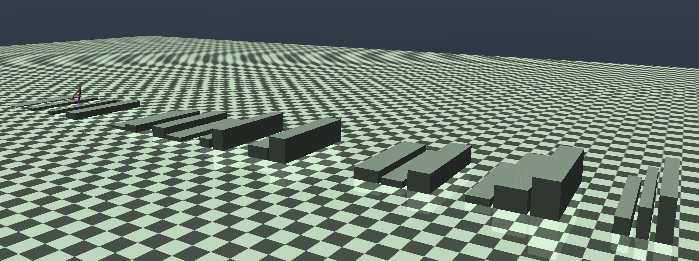

# [2025 Samsung DS] RL Project Practice 1: Controller Training

This repository contains the skeleton code for **Practice 1** of the Samsung DS RL Project.  
It is based on the [Walker2d-v5](https://github.com/Farama-Foundation/Gymnasium) environment from OpenAI Gymnasium, and demonstrates training using PPO from [Stable-Baselines3](https://stable-baselines3.readthedocs.io/en/master/).

## Installation

We have tested this code on Ubuntu 22.04 and Windows.

```bash
# Create a virtual environment
cd {project_folder}
python -m venv venv

.\venv\Scripts\activate # Windows
source ./venv/bin/activate # Linux

# Install dependencies
pip install "stable_baselines3[extra]>=2.0.0a9"
pip install "gymnasium[mujoco]"
```

## Training

Train a controller using Deep Reinforcement Learning (PPO).  
The trained model will be saved in the `checkpoints/` folder as a `.zip` file.

```bash
# Optional arguments:
# --bump_practice    Train with 2 bumps
# --bump_challenge   Train with 8 bumps (for the team challenge)
python learning.py (--bump_practice) (--bump_challenge)
```

### Hyperparameters

You can modify hyperparameters for PPO in `learning.py` under `policy_kwargs` (Refer to the Stable-Baselines3 PPO documentation (https://stable-baselines3.readthedocs.io/en/master/modules/ppo.html) for available options).

## Rendering

Simulate the trained model.

```bash
# Arguments:
# --model           Path to the trained model
# --bump_practice   Simulate on 2 bumps terrain
# --bump_challenge  Simulate on 8 bumps terrain (team challenge)
# --record          Press 'r' to start recording, and press 'r' again to stop.
#                   Video will be saved as record_{model_name}.mp4
python render.py --model {model_path} (--bump_practice) (--bump_challenge) (--record)
```

## Logging

Training logs are saved in the `logs/` directory. You can visualize them with TensorBoard:

```bash
tensorboard --logdir=logs
```

## Environment Details

### Bump Terrain Information



The environment includes several bump obstacles defined in the XML. 
Their positions and sizes are as follows:

`custom_walker2d_bumps_practice.xml`

| Bump        | Position         | Size              |
|-------------|------------------|-------------------|
| Bump #1     | (6.0, 0.0, 0.0)  | (0.3, 2.0, 0.2)   |
| Bump #2     | (10.0, 0.0, 0.0) | (0.6, 2.0, 0.45)  |


`custom_walker2d_bumps.xml` (team challenge)

| Bump        | Position         | Size              |
|-------------|------------------|-------------------|
| Bump #1     | (2.0, 0.0, 0.0)  | (0.5, 2.0, 0.05)  |
| Bump #2     | (4.0, 0.0, 0.0)  | (0.3, 2.0, 0.15)  |
| Bump #3     | (6.0, 0.0, 0.0)  | (0.2, 2.0, 0.2)   |
| Bump #4     | (8.0, 0.0, 0.0)  | (0.4, 2.0, 0.35)  |
| Bump #5     | (12.0, 0.0, 0.0) | (0.5, 2.0, 0.15)  |
| Bump #6     | (13.0, 0.0, 0.0) | (0.4, 2.0, 0.35)  |
| Bump #7     | (15.0, 0.0, 0.0) | (0.4, 2.0, 0.5)   |
| Bump #8     | (16.0, 0.0, 0.0) | (0.5, 2.0, 0.2)   |
| Bump #9     | (18.0, 0.0, 0.0) | (0.3, 2.0, 0.4)   |
| Bump #10    | (18.8, 0.0, 0.0) | (0.3, 2.0, 0.9)   |
| Bump #11    | (21.0, 0.0, 0.0) | (0.5, 2.0, 0.5)   |
| Bump #12    | (22.0, 0.0, 0.0) | (0.4, 2.0, 1.0)   |
| Bump #13    | (26.0, 0.0, 0.0) | (0.5, 2.0, 0.45)  |
| Bump #14    | (27.0, 0.0, 0.0) | (0.4, 2.0, 0.25)  |
| Bump #15    | (28.0, 0.0, 0.0) | (0.4, 2.0, 0.7)   |
| Bump #16    | (30.0, 0.0, 0.0) | (0.4, 2.0, 0.25)  |
| Bump #17    | (31.0, 0.0, 0.0) | (0.5, 2.0, 0.75)  |
| Bump #18    | (32.0, 0.0, 0.0) | (0.4, 2.0, 1.2)   |
| Bump #19    | (34.0, 0.0, 0.0) | (0.2, 2.0, 0.5)   |
| Bump #20    | (34.5, 0.0, 0.0) | (0.15, 2.0, 0.9)  |
| Bump #21    | (35.0, 0.0, 0.0) | (0.2, 2.0, 1.3)   |


### Customization

You can customize the Observation, Reward, and Termination Condition in `custom_walker2d.py`.  We recommend modifying the sections marked with `TODO`.

Note: Do not modify the XML file path or environment parameters in `__init__`. Test will be based on the default environment setup.


## Reference

- https://github.com/snumrl/2025_SNU_HumanMotion_HW.git

